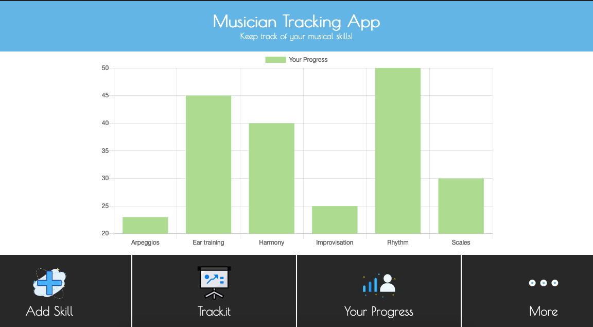

<h1 align="center">Musician Tracking App</h1>

  

# :arrow_right: [Live Demo]()

## Author

:man: Julian Belmonte

- Github: [Julian Belmonte](https://github.com/jucora)
- Twitter: [@Julian Belmonte](https://www.twitter.com/JulianBelmonte)
- Linkedin: [Julian Belmonte](https://www.linkedin.com/in/julianbel)

## :pencil: Main Description

This is the final project of the React module. It consists of the creation of a monitoring application on a subject of free choice. In this case, I created an application to follow the musicians' study routines.

This application is connected to an API developed in Ruby on Rails. To access the API, click here

For more information about the project requirements, please follow the next link: [React Final Capstone Project](https://www.notion.so/Final-Capstone-Project-Tracking-App-22e454da738c46efaf17721826841772)

## How to install the App

1. Please clone the repository by running the next comand in your machine:

<pre><code>git clone https://github.com/jucora/musician-tracking-app.git</code></pre>

2. Next, run the next command to install all project dependencies:

   For Yarn: <pre><code>yarn install</code></pre>
   For npm: <pre><code>npm install</code></pre>

## How to run the app locally

1. Get into the folder of the project by running the next command:

<pre><code>cd musician-tracking-app</code></pre>

2. Start your local server by running the next command:

   For Yarn: <pre><code>yarn start</code></pre>
   For npm: <pre><code>npm start</code></pre>

## :computer: Library, Languages and technologies

- React
- React-DOM
- Redux
- JSX
- SCSS
- Node.js
- prop-types
- npm
- Javascript
- Chart.js

## Report Issues

Please feel free to make a contribution, report any issue, feature request or provide any feedback. Click [here](https://github.com/jucora/musician-tracking-app/issues)

## Support

Feel free to drop a like, that would support me a lot.
